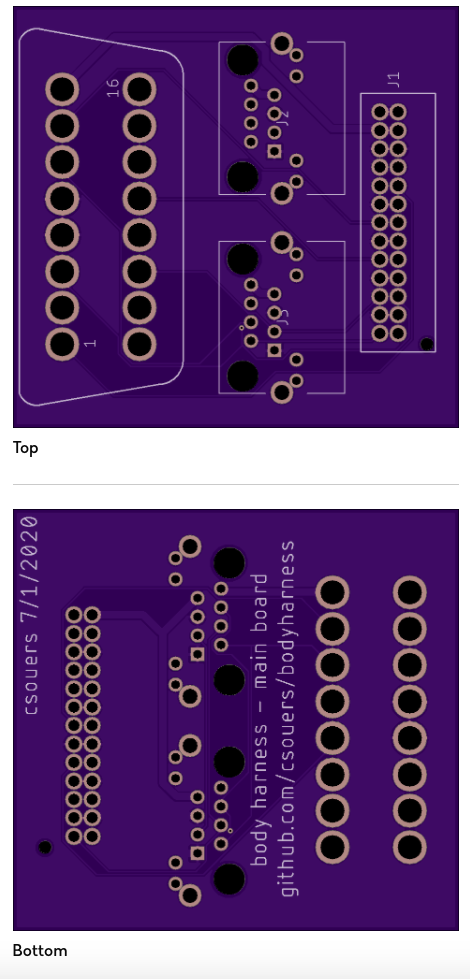

# bodyharness (Work in Progress)

## Get access to your body control module's CAN bus (or multiple busses), K-Line, and L-Line without damaging or back-probing the vehicle's electrical wiring.

This hardware, together with the necessary software, makes it possible to control turn signals, lights, and more. This project is intended to be 100% reversible in minutes. No cutting any wires!

We're currently using a comma.ai panda (white or grey) for the brains. Black panda can be supported with additional effort (no plans for this at the moment). The supported pandas have 3 CAN busses, K-Line, L-Line, and a single GMLAN (operates in place of one of the panda's CAN bus connections).

## Board Previews
### Main

### Honda Type 1
#### Compatible:
Honda Civic Hatchback 2017 (US Market) 
Honda CR-V 2017 (US Market) 
#### Incompatible
Honda Accord 2018+ (US Market) 

## Compatibility
##### Based on vehicle generation. Vehicles may vary. Check this first!
| Make | Model | B-CAN Connection Location |
| -- | -- | -- |
| Acura     | ILX 2016-18                   | ?                                                                                             |
| Acura     | RDX 2016-18                   | ?                                                                                             |
| Honda     | Accord 2018-20                | Option Connector (Pinout A) PINK 2+ / BLUE 3-                                                |
| Honda     | Accord Hybrid 2018-20         | Option Connector (Pinout A) PINK 2+ / BLUE 3-                                                |
| Honda     | Civic Hatchback 2017-19       | Option Connector (Pinout A) PINK 2+ / BLUE 3-                                                |
| Honda     | Civic Sedan/Coupe 2016-18     | Option Connector (Pinout A) PINK 2+ / BLUE 3-                                                |
| Honda     | Civic Sedan/Coupe 2019-20     | Option Connector (Pinout A) PINK 2+ / BLUE 3-                                                |                                              
| Honda     | CR-V 2015-16                  | (DIY) at BCM/Under Dash Fuse Box or other module                                             |
| Honda     | CR-V 2017-20                  | Option Connector (Pinout A) PINK 2+ / BLUE 3-                                                |                                              
| Honda     | CR-V Hybrid 2017-2019         | Option Connector (Pinout A) PINK 2+ / BLUE 3-                                                |
| Honda     | Fit 2018-19                   | (DIY) 2018 at BCM/Under Dash Fuse/Relay Box or other module - 2019+ at ADAS Camera Connector |
| Honda     | HR-V 2019-2021                | (DIY) at ADAS Camera Connector                                                               |
| Honda     | Insight 2019-20               | (DIY) at BCM/Under Dash Fuse/Relay Box or other module                                       |
| Honda     | Odyssey 2018-20               | Option Connector (Pinout B) PINK 2+ / BLUE 5-                                                |
| Honda     | Passport 2019                 | (DIY) BCM/Under Dash Fuse/Relay Box or other module - 2020+ at ADAS Camera Connector         |
| Honda     | Pilot 2016-19                 | (DIY) BCM/Under Dash Fuse/Relay or other module - 2019+ at ADAS Camera Connector             |
| Honda     | Ridgeline 2017-20             | (DIY) BCM/Under Dash Fuse/Relay or other module - 2020+ at ADAS Camera Connector             |

As usual, anything on this repository is to be used AT YOUR OWN RISK! You maintain all liability.
<!--stackedit_data:
eyJoaXN0b3J5IjpbMTAyMDg2MzIxNCw4MjI2NDQ3OTEsLTk1Nj
MwMjA3NiwtMTA4NjM2NzEwMiwxNDYwOTY0NjcxLDE2NzI0MDkw
NjIsLTE4NDM3OTQyNTAsLTIxNTEzMzYxMSwtMTEwMjgwNDYyNy
wxNTMyNDM0Mjk2XX0=
-->