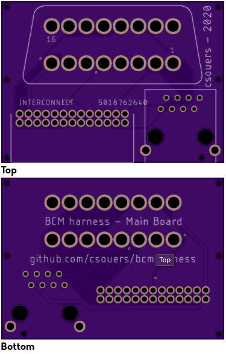

# bcmintercept
Intercept your car's BCM for hacking fun

Uses a two board setup, much like comma.ai car harness. Main board should stay the same for all cars and variants. The secondary board will change depending on the vehicle's requirements.

